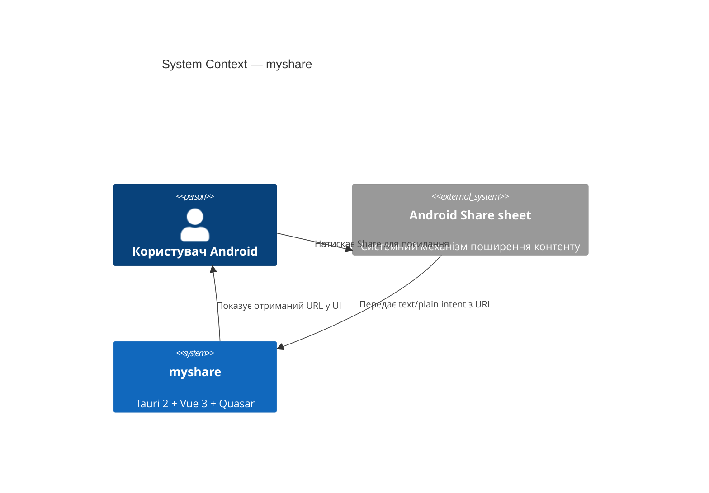
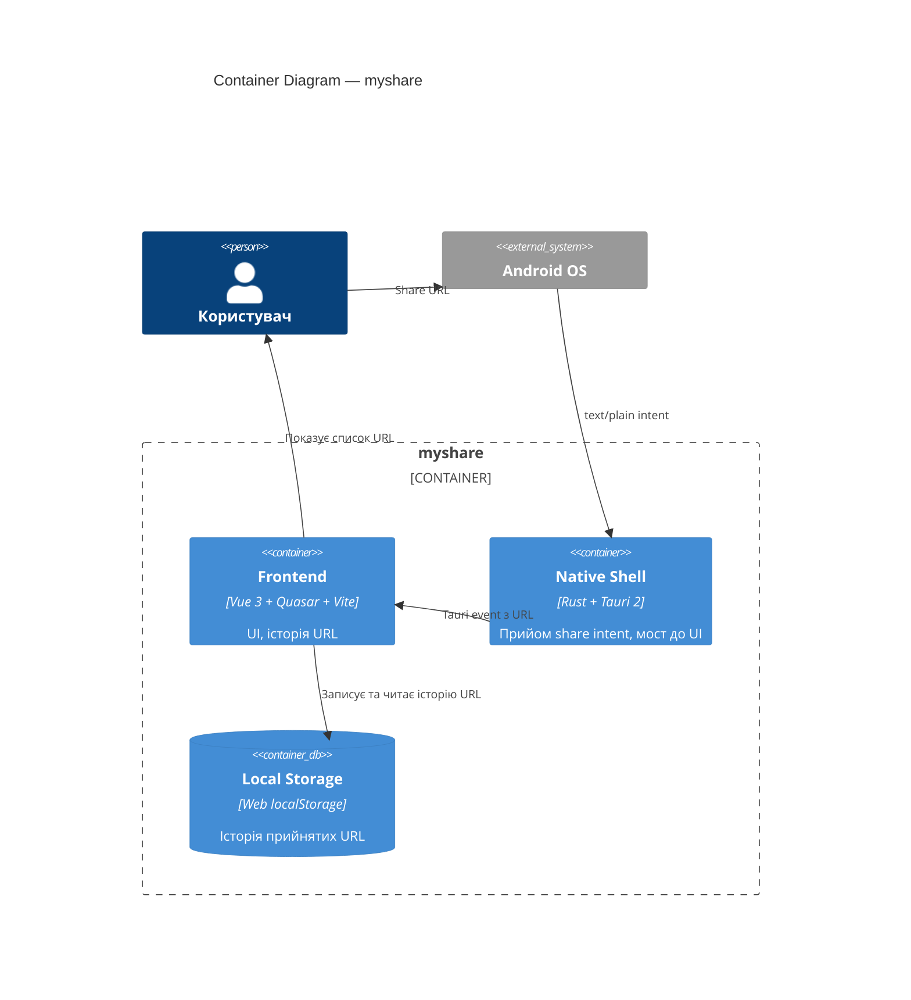

# Architecture (arc42)

Документ описує архітектуру застосунку `myshare` у скороченому форматі **arc42**. Розділи 1–3 — менеджерський контекст, 5–9 — інженерні деталі під collapsible-блоками `??? engineer`.

## 1. Introduction and Goals

`myshare` — Android-застосунок, який приймає посилання через стандартний Android Share механізм і показує отриманий URL користувачу. Технологічна основа — Tauri 2 + Vue 3 + Quasar у bun-монорепо.

Ключова якісна вимога першої версії `myshare` — коректний приймач `text/plain` share intent із URL і відображення цього URL у UI без додаткової обробки.

## 2. Constraints

- Платформа: Android (Tauri 2 mobile).
- Runtime інструментів збірки: `bun >= 1.3`, `node >= 24`.
- UI-стек зафіксовано: Vue 3 + Quasar + Vite.
- Native-частина застосунку `myshare` пишеться на Rust у `src-tauri/`.

## 3. Context and Scope

## 4. Solution Strategy

Застосунок `myshare` реалізується як Tauri 2 mobile-білд із Vue 3 + Quasar UI. Share intent приймається у native Android-шарі (Rust + Tauri 2 mobile API), URL передається у frontend через Tauri event/command і відображається на екрані Quasar.

## 5. Building Block View

??? engineer "Розташування коду застосунку `myshare` у репозиторії" - `app/` — frontend (Vue 3 + Quasar + Vite) і `app/src-tauri/` (Rust + Tauri 2 mobile). - `app/src/shared-url.js` — чистий витяг URL із тексту share intent. - `app/src/url-history.js` — load/save/append для історії URL у `localStorage` під ключем `myshare.sharedUrls`. - `app/src/page-meta.js` — фетч `{title, favicon}` цільової сторінки через `@tauri-apps/plugin-http`; деталі — [components/page-meta](./components/page-meta.md). - `app/src/youtube.js` — детекція YouTube URL, фетч caption tracks, вибір uk→en та XML→plain text для перегляду субтитрів; деталі — [components/youtube](./components/youtube.md). - `app/src/platform.js` — UA-based детекція Android для умовного рендеру dev-helper'а; деталі — [components/platform](./components/platform.md). - `app/src-tauri/gen/android/app/src/main/java/com/vitaliytv/myshare/MainActivity.kt` — Kotlin-перехоплювач `ACTION_SEND` intent із вкиданням URL у WebView через `evaluateJavascript` (localStorage + CustomEvent). - `scripts/` — допоміжні node-скрипти, зокрема `docs-regen`. - `docs/` — джерело істини архітектурної документації `myshare` (arc42 + ADR + проекції).

## 6. Runtime View

Сценарій прийому посилання у застосунку `myshare`:

1. Користувач у будь-якому Android-застосунку натискає **Share** для посилання.
2. Користувач обирає `myshare` у системному Android share sheet.
3. Native Shell `myshare` (Kotlin `MainActivity`) отримує `ACTION_SEND` intent із URL.
4. `MainActivity` вкидає URL у WebView через `evaluateJavascript`: пише у `localStorage['myshare.sharedText']` та диспатчить DOM-подію `myshare:android-share`.
5. Frontend `myshare` витягає URL із тексту, додає його на початок історії й записує оновлений масив до Local Storage (`localStorage['myshare.sharedUrls']`).
6. Для нового URL Frontend `myshare` асинхронно фетчить **Page Metadata** (`{title, favicon}`); якщо URL — YouTube, додатково фетчить **Caption Tracks** і вибирає трек за пріоритетом `uk → en` (manual вище за auto).
7. Frontend `myshare` відображає актуальну історію URL на екрані; на старті застосунку історія читається з Local Storage, після чого для кожного URL запускаються кроки п.6.
8. Тап кнопки субтитрів на YouTube-картці завантажує **Timedtext XML** через `Caption Track.baseUrl` і показує транскрипт у діалозі.

## 7. Deployment View

Артефакт постачання `myshare` — Android APK/AAB, зібраний `tauri android build`. У dev-режимі `myshare` запускається через `bun run start` (alias до `tauri dev`) на підключеному пристрої або емуляторі Android.

## 8. Crosscutting Concepts

Розділ заповнюватиметься в міру появи accepted ADR `myshare` за темами: безпека обробки URL, локалізація UI, логування, обробка помилок share intent.

**Локальне сховище.** Frontend `myshare` зберігає історію прийнятих URL у Web `localStorage` під ключем `myshare.sharedUrls` — JSON-масив рядків, найсвіжіший URL першим. Це єдине місце персистентності `myshare` поза runtime; native-частина застосунку нічого окремо не персистить. Опис модуля — [components/url-history](./components/url-history.md).

**Cross-origin HTTP.** WebView-CORS блокує fetch до зовнішніх сайтів із origin `http://localhost:1420` (dev) або `tauri://localhost` (prod). Frontend `myshare` для favicon/title (`page-meta`) використовує `@tauri-apps/plugin-http`, який проксує fetch через Rust і CORS-policy WebView не торкається. Дозволені цілі — capability `http:default` із `http://**` + `https://**` у `app/src-tauri/capabilities/default.json`.

**YouTube транскрипт через supadata.** Власна реалізація subtitle-фетчу постійно ламається через PO-Token (підтверджено на прямих timedtext, Innertube `/player`, `youtubei.js` + cookie jar) — YouTube anti-bot блокує всі anonymous-клієнти. Тому `myshare` делегує транскрипт-фетч зовнішньому сервісу supadata.ai: одна Tauri-команда `yt_get_transcript` стукає supadata REST API з `x-api-key`, повертає `{ languageCode, text, availableLangs }`. API ключ захардкоджений у Rust-константі `SUPADATA_API_KEY` (у `app/src-tauri/src/youtube.rs`) — застосунок `myshare` не має secret-management шару, тож ключ живе у коді задля нульового setup. Опис компонента — [components/youtube](./components/youtube.md).

**Платформа-залежний UI.** Share intent на Android — рідний механізм OS; на desktop його немає. Модуль [components/platform](./components/platform.md) дає Frontend `myshare` поточну ознаку «це Android», за якою у `App.vue` ховається dev-only helper для ручного введення URL на маку. Це гарантує, що production-Android-білд не має лишнього UI, а desktop-розробка не вимагає симулювати share intent через DevTools.

<!-- AUTOGEN:start id="crosscutting-decisions" hash="sha256:pending" sources="" -->

Регенерується з accepted ADR `myshare` за тематикою crosscutting (поки порожньо).

<!-- AUTOGEN:end id="crosscutting-decisions" -->

## 9. Architecture Decisions

Індекс accepted ADR `myshare` живе у [`docs/adr/index.md`](../adr/index.md). Кожна архітектурна зміна — нове рішення MADR v4 minimal у `docs/adr/<slug>.md`.

## 10. Quality Requirements

Перша версія `myshare`: успішний прийом `text/plain` share intent з URL і відображення URL у UI без падіння застосунку.

## 11. Risks and Technical Debt

Ризики застосунку `myshare` фіксуються через ADR із `**Status:** Accepted` за тематикою ризиків і технічного боргу.

## 12. Glossary

Дивись [`docs/glossary.md`](../glossary.md) для термінології проєкту `myshare`.
